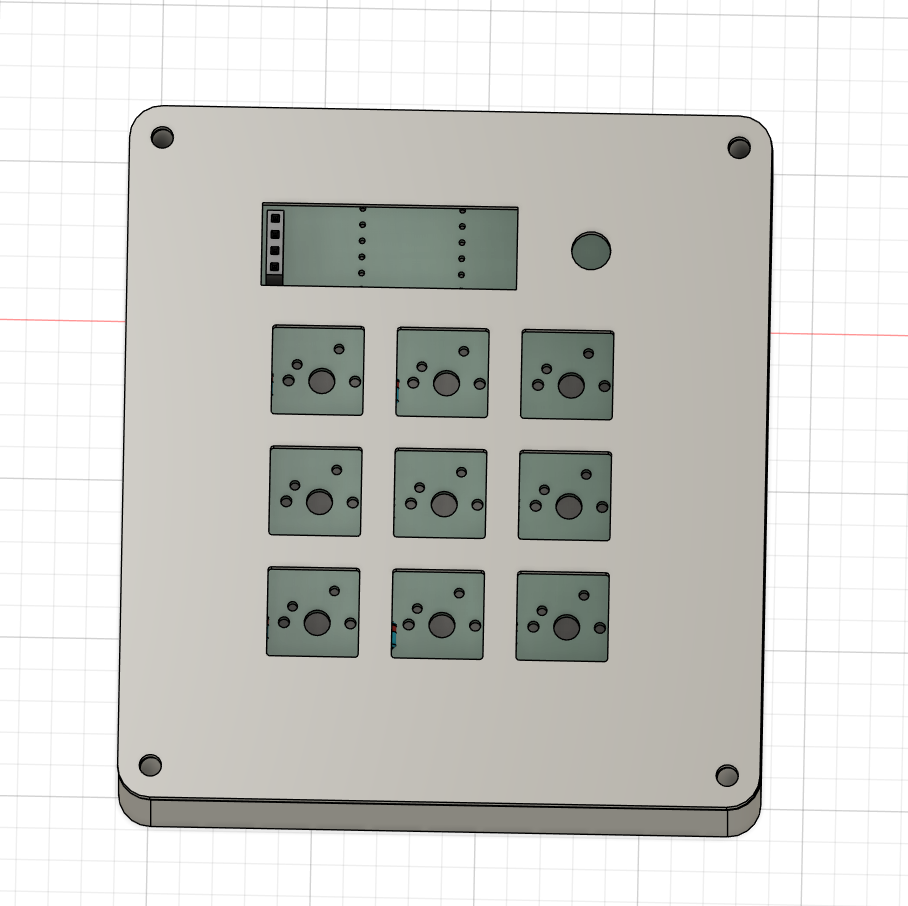
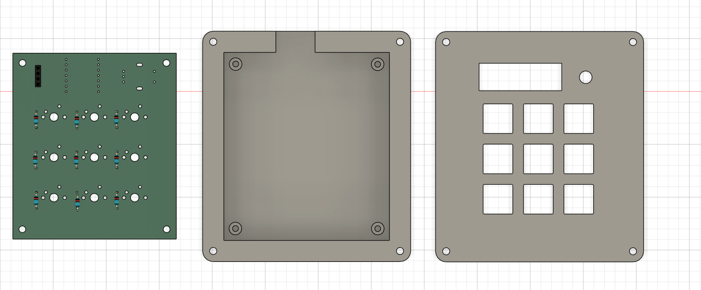
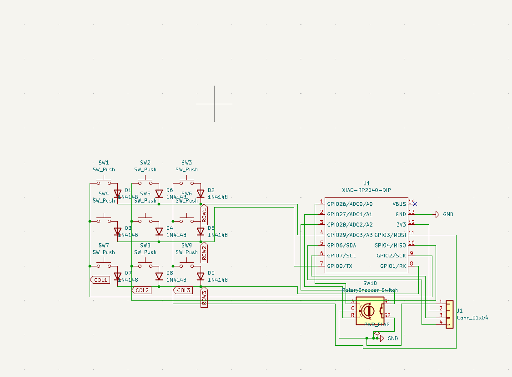

# Nitro-Macropad

## Overview
The Nitro-Macropad is a 9-key mechanical macro pad with a rotary encoder and an OLED display, powered by the Seeed XIAO RP2040. Designed in KiCad and running on KMK Firmware. The 9 keys are arranged in a 3x3 grid.

| Full Case | Case Apart |
| :---: | :---: |
|  |  |

| PCB | Schematic |
| :---: | :---: |
|  |  |
## Features

* 9 Mechanical Keys (Cherry MX footprint)
* Rotary Encoder for volume/scrolling
* OLED Display (0.91" I2C)
* QMK/KMK Compatible

## Project Structure

* `/Hardware`: KiCad schematic, PCB layout, and Gerber files.
* `/Case`: 3D printable case files (STEP & STL).
* `/Firmware`: KMK (CircuitPython) configuration code.
* `/Production`: Everything you need to replicate the Nitro-Macropad.

## Bill of Materials (BOM)
* 1x Seeed XIAO RP2040 (Microcontroller)
* 9x Cherry MX Style Switches 
* 10x 1N4148 Diodes (Through Hole) 
* 1x EC11 Rotary Encoder 
* 1x 0.91" OLED 
* Case 3D Printed (PLA/PETG) 

## Firmware Setup
1\.  Install \[CircuitPython](https://circuitpython.org/board/seeeduino\_xiao\_rp2040/) on the XIAO.
2\.  Copy the \[KMK Firmware](https://github.com/KMKfw/kmk\_firmware) library to the board.
3\.  Copy `Main.py` from the `/Production` folder to the root of the device.

## License
This project is open source. Feel free to use and modify!

